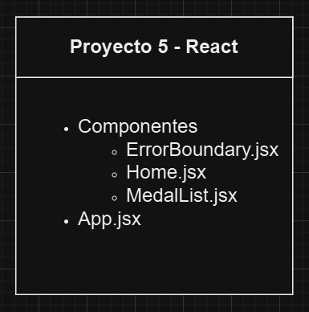
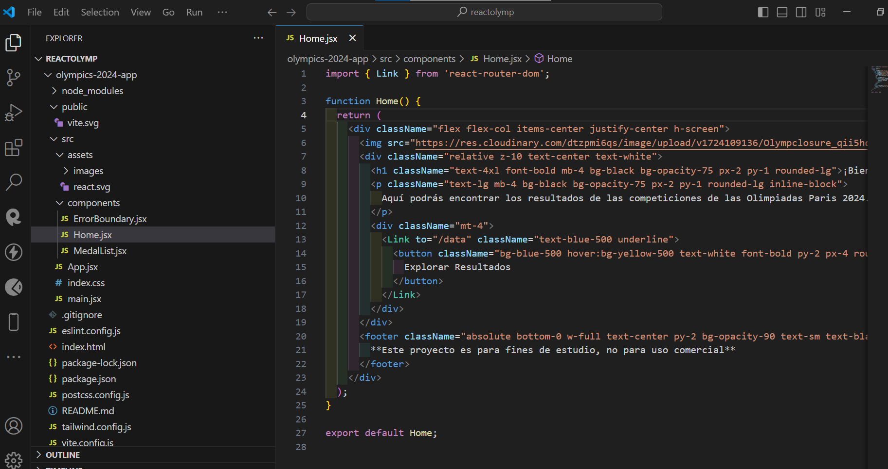
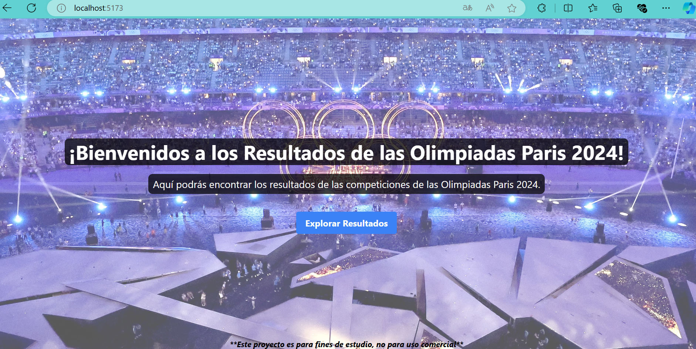
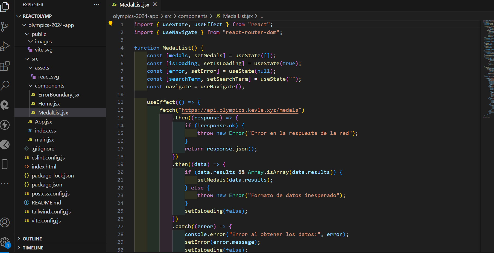
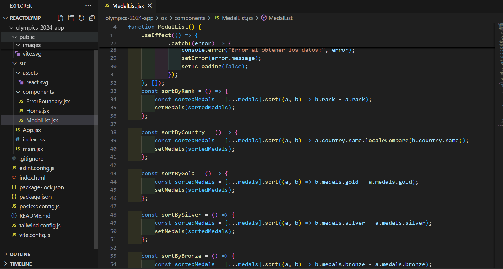
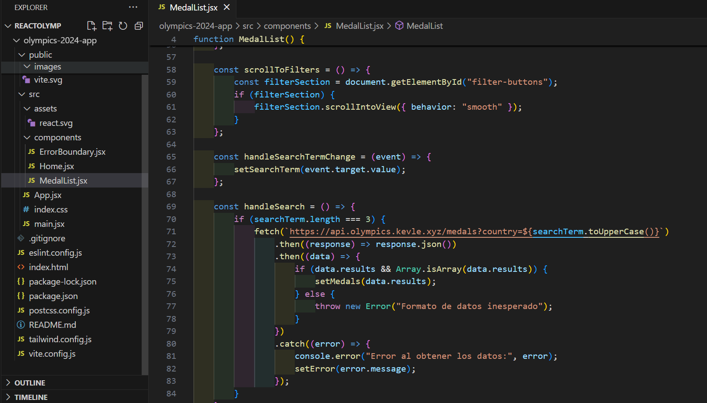
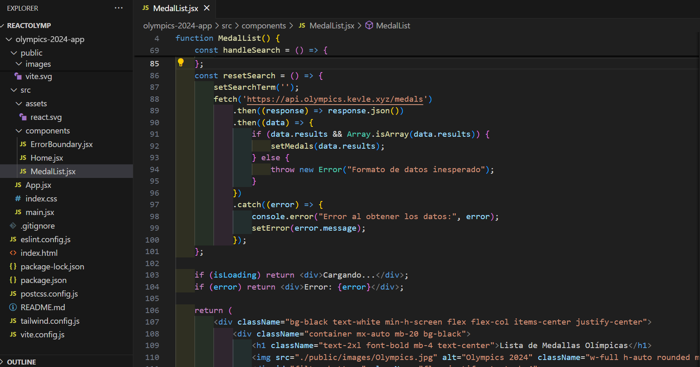
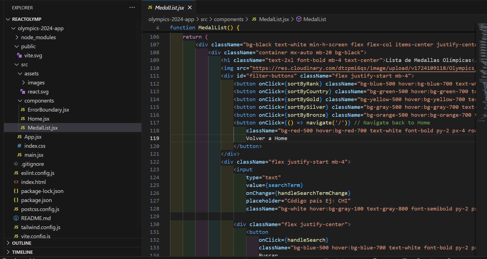
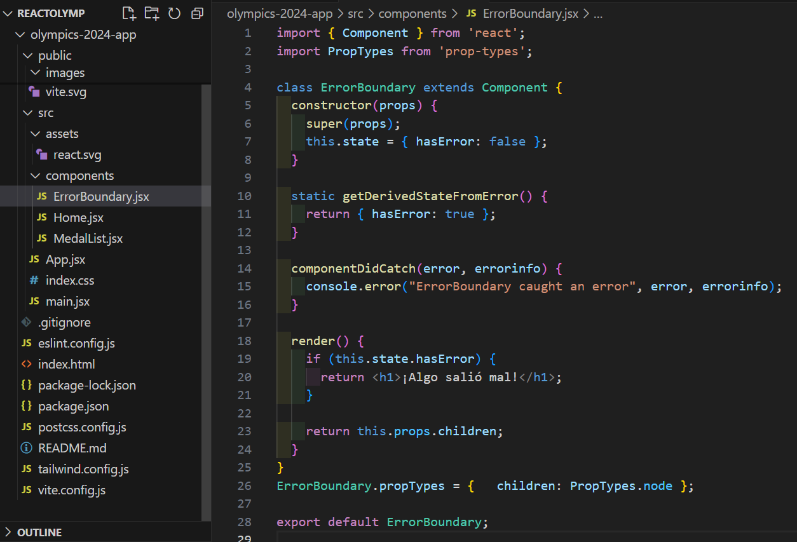
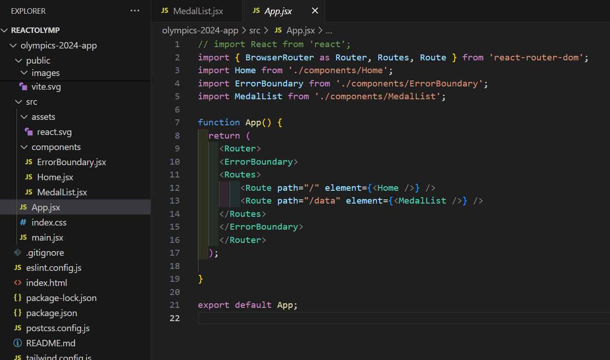

# Módulo 5 - Proyecto 5
## ¡Bienvenidos al proyecto "Aplicación Web con React"!

## Tabla de Contenidos
* [1. Desafío](#1-Desafío)
* [2. Desarrollo de proyecto](#2-Desarrollo-de-proyecto)
* [3. Conclusiones](#3-Conclusiones)

****
## Desarrollo

### 1. Desafio
 Para este quinto proyecto se solicita crear una aplicación web con React que consumirá datos de una API pública. Los datos que obtenga de la API se mostrarán en una interfaz de usuario.
 Esta aplicación deberá:
- Conectar con una API para obtener datos
- Mostrar los datos en una interfaz de usuario
- Permitir alguna interacción del usuario (por ejemplo, mediante botones o formularios)

 Los requerimientos para este proyecto son:
 - Uso de vite para la generación del proyecto
 - Crear componentes funcionales
 - Utilizar una API pública y mostrar los datos obtenidos en tu interfaz de usuario
 - Uso de Hooks (mínimo useEffect para los procesos asíncronos)
 - Implementar rutas en tu aplicación con React Router
 - Manejar errores de renderizado con Error Boundaries
 - Implementación CSS a través de un framework (TailwindCSS, MUI, Bootstrap)

  ****

### 2. Desarrollo de proyecto
 Luego de revisar las API disponibles en la Web, además de buscar información interesante en los medios, se seleccionó una API pública relacionada a las Olimpiadas de Paris 2024.
 Se incluye como referencia información sobre la API para mayor detalle: [Link API](https://github.com/kevle1/paris-2024-olympic-api?tab=readme-ov-file)
 
 En resumen esta API permite visualizar las medallas ganadas por los paises participantes, y la idea es disponibilizar la información a los usuarios, que puedan interactuar con distintos botones para ordenar la información, además que permita a los usuarios buscar 
 por país, considerando que se debe usar la codificación indicada por el Comité de las Olimpiadas,  NOCs ("National Olympic Committees"), se incluye link en esta sección a modo de referencia e importante mencionar que esta misma información fue incluida en un 
 componente, por experiencia de usuario, para facilitar la búsqueda de los códigos de los países.
 [Link NOCs](https://en.wikipedia.org/wiki/List_of_IOC_country_codes#Current_NOCs)

 Luego de seleccionar la API como fuente, se crea la estructura del proyecto, en donde se define lo siguiente:

 

 Se ejecutan los códigos y parámetros necesarios tanto de Vite, React, React-Dom, Tailwind CSS, entre otros, además de aplicar los ajustes necesarios en las instalaciones. 
 Posterior a esto se crea la carpeta y archivos necesarios con el fin de desplegar la 
 estructura propuesta en Visual Studio Code. Se incluyen algunos recursos adicionales como imagenes de apoyo para los componentes de Home.jsx y MedalList.jsx.

 En el componente "Home.jsx" se crea una función Home donde se incluye una imagen de base, además de contenido de bienvenida a los usuarios, incluyendo un botón de acción para que los usuarios sean redireccionados hacia otra página. A continuación se muestra tanto 
 el código como su renderización:

 

 

  En "MedalList.jsx" se crea una función MedalList, incluyendo una serie de constantes, además de hooks necesarios para la ejecución del código. En la primera parte del componente, se crea un hook de useEffect, del cual se incluye un fecth para conectarse a la API 
  y traer data, además se incluye una validación de error. Si la respuesta esta ok, entonces nos devolverá los datos de JSON. 
  Se incluye un setLoading que permite indicar al usuario si se está cargando data.

  

  Luego se crean constantes que permitirán ordenar la data en base a distintos criterios, como ranking, país, medallas de oro, plata, bronce. 

  

  En esta sección del código se habilitan funciones, tales como:
  - Permite moverse desde el final de la página hasta la sección de botones.
  - Actualiza un estado del componente cuando el usuario ingresa información para una búsqueda, en base a 3 caracteres que el usuario ingresará para buscar un país específico.
  - 
  

  Luego se define una función que permite hacer un reset de la data filtrada, volviendo a desplegar los datos ordenados.

  

   Ahora por medio de return se muestra para los usuarios, desde el punto de vista UI, elementos como titulo, imagen, botones, búsqueda, link, tabla, entre otros recursos y ajustes a las propiedades, que permimtirán hacer visible la información con los formatos 
   precisos y ordenados.

  

  Se agrega un componente específico para el manejo de Error Boundary:

  

  Por último em App.jsx, se realizan las rutas hacia los otros componentes:

  

  ****

  ### 3. Conclusiones
 Para la preparación del proyecto de Aplicaciones Web con React, se analizaron diferentes variables con el fin de hacer un proyecto interesante, luego de varias iteraciones, diferentes ideas y ejecuciones de pruebas, se llegó a la API de referencia a las Olimpiadas 
 que permitía desplegar la data, desde el medallero, esto permitiendo crear varios botones que llama a los usuarios a que juegen con distintas opciones, así como también permitiendo una búsqueda por paises, en base a códigos publicados por el Comité de las 
 Olimpiadas. Esta API es simple en su universo de datos, por este motivo se habilitaron varias secciones de botones y búsqueda, además de reseteo de las mismas.
 Se realizaron varias pruebas en los códigos de los componentes, debido a que inicialmente no se obtenía la data, después de varios analisis, entendiendo la estructura de la data y de la API, asi como revisiones y reescritura de los códigos, se llegó a renderizar 
 la data y hacer funcionar el proyecto finalmente.

  ****
*¡Gracias!*
